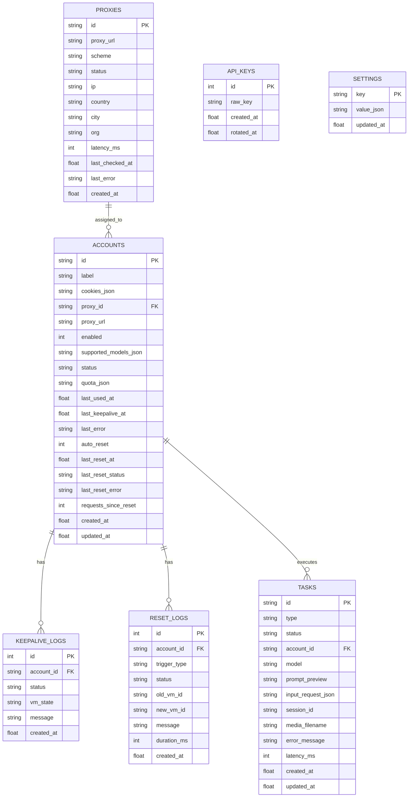

# Entity Relationship Diagram — Sơ đồ Cơ sở dữ liệu

Cơ sở dữ liệu SQLite (`data/muse2apiv2.db`, chế độ `WAL`) gồm 7 bảng chính:

```mermaid
erDiagram
    PROXIES {
        string id PK
        string proxy_url
        string scheme
        string status
        string ip
        string country
        string city
        string org
        int latency_ms
        float last_checked_at
        string last_error
        float created_at
    }

    ACCOUNTS {
        string id PK
        string label
        string cookies_json
        string proxy_id FK
        string proxy_url
        int enabled
        string supported_models_json
        string status
        string quota_json
        float last_used_at
        float last_keepalive_at
        string last_error
        int auto_reset
        float last_reset_at
        string last_reset_status
        string last_reset_error
        int requests_since_reset
        float created_at
        float updated_at
    }

    KEEPALIVE_LOGS {
        int id PK
        string account_id FK
        string status
        string vm_state
        string message
        float created_at
    }

    RESET_LOGS {
        int id PK
        string account_id FK
        string trigger_type
        string status
        string old_vm_id
        string new_vm_id
        string message
        int duration_ms
        float created_at
    }

    TASKS {
        string id PK
        string type
        string status
        string account_id FK
        string model
        string prompt_preview
        string input_request_json
        string session_id
        string media_filename
        string error_message
        int latency_ms
        float created_at
        float updated_at
    }

    API_KEYS {
        int id PK
        string raw_key
        float created_at
        float rotated_at
    }

    SETTINGS {
        string key PK
        string value_json
        float updated_at
    }

    PROXIES ||--o{ ACCOUNTS : "assigned_to"
    ACCOUNTS ||--o{ KEEPALIVE_LOGS : "has"
    ACCOUNTS ||--o{ RESET_LOGS : "has"
    ACCOUNTS ||--o{ TASKS : "executes"
```
